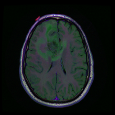
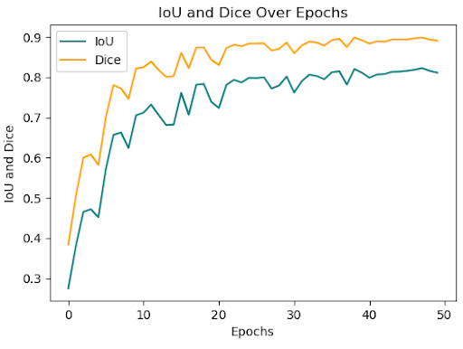

## Biomedical Image Models

These models are convolutional neural networks trained on my local GPU, which work with MRI brain scans to create outlines of possible tumors or abnormalities. This project has undergone many iterations, training cyles, and tuning manipulations to come up many models, and this folder showcases a few models trained.

The models used a virtual environment utilizing Conda and WSL to run a jupyter notebook on VScode locally, which would access your local GPU for training. It used PyTorch, a Python library, to implement and train models with various architectures to segment any abnormalities and tumors from inputted brain MRI images. 

Example:
  
           Image                             Model Prediction                     True Masks

These images reflect one of my U-NET models visuzalizing its training cycle.
 
-Dev Loss is used to identify how the model is training each cycle or epoch. The lower the better.
-The second image showcases the two common metrics for a models accuracy during each epoch

